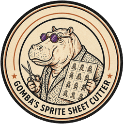

# Gomba's Sprite Sheet Cutter

  

> Drop in a sprite sheet, hit Process, download clean numbered PNGs — ready for Discord, Twitch, or your game engine.

  
  &nbsp;&nbsp;
  

*A small tool made with care, by Gomba.*

---

## What is this?

If you've ever commissioned or downloaded a beautiful set of emoji stickers or sprite sheets and spent an afternoon manually cutting each little character out one by one — this tool is for you.

**Gomba's Sprite Sheet Cutter** takes your sprite sheets, removes the background, automatically detects every individual sprite, and exports them as clean, numbered PNG files ready to upload straight to Discord, Twitch, or wherever your characters belong.

Drop in a sheet. Hit Process. Download your emojis. That's it.

---

## Features

- 🎨 **Four background removal options** — AI/rembg models, anime-specialist ToonOut, Lucida for illustration and soft transparency, or Skip for sheets that already have alpha
- ✂️ **Automatic sprite detection** — finds every sprite on the sheet using connected-component analysis, with intuitive minimum width and height controls
- 🔢 **Batch processing** — drop in multiple sheets at once, sprites are numbered sequentially across all of them
- 📐 **Resize to any size** — built-in letterbox resize, defaults to 128×128 (perfect for Discord emojis)
- 🖼️ **Live edge preview** — inspect your results against black, white, or checkerboard backgrounds before downloading
- 🧹 **Edge cleanup tools** — defringe (with strength and spread controls), contract, smooth, and feather for pixel-perfect results
- 🔬 **Eyedropper color picker** — click directly on the sprite sheet to sample the background color for defringe instead of typing a hex value
- 🔗 **Auto-merge center proximity** — joins detected parts whose bounding-box centers are within a set distance, reducing accidental merges between neighboring full sprites
- 📏 **Detected crop dimensions** — reports every numbered sprite's width × height before resizing, making size filters and auto-merge distances easier to tune
- ✏️ **Manual merge** — look at the numbered preview and type e.g. `3+14+15` to manually join specific sprites into one bounding box, with instant ZIP re-export — no reprocessing needed

---

## Installation

**Requirements:** Python 3.10 or higher — download from [python.org](https://www.python.org)

1. Unzip this folder anywhere on your computer
2. Double-click **`launch.bat`**
3. The first launch will automatically create a virtual environment and install all dependencies (this may take a few minutes — AI models are downloaded on first use)
4. The app opens in your browser at `http://127.0.0.1:7860`
5. *(Optional)* Double-click **`create_shortcut.bat`** to add a Desktop shortcut

Every subsequent launch just runs `launch.bat` — updates and new packages install automatically.

---

## Model Licensing

This app uses several open-source AI models. Their respective licenses apply:

| Model / Library | Author | License |
|---|---|---|
| **rembg** | Daniel Gatis | [MIT License](https://github.com/danielgatis/rembg/blob/main/LICENSE.txt) |
| **BiRefNet** (base architecture) | ZhengPeng7 | [MIT License](https://github.com/ZhengPeng7/BiRefNet/blob/main/LICENSE) |
| **ToonOut** (BiRefNet fine-tune) | joelseytre / MatteoKartoon | [BiRefNet license applies](https://github.com/MatteoKartoon/BiRefNet) |
| **Lucida** (BiRefNet fine-tune) | Ege Orçun | [MIT model and code](https://huggingface.co/egeorcun/lucida) |
| **isnet-anime / isnet-general-use** | xuebinqin | [MIT License](https://github.com/xuebinqin/DIS) |
| **u2net** | xuebinqin | [Apache 2.0](https://github.com/xuebinqin/U-2-Net/blob/master/LICENSE) |
| **Gradio** | Hugging Face | [Apache 2.0](https://github.com/gradio-app/gradio/blob/main/LICENSE) |
| **PyTorch** | Meta / PyTorch team | [BSD License](https://github.com/pytorch/pytorch/blob/main/LICENSE) |

This tool itself is free to use and share. Please respect the licenses of the underlying models, especially for commercial use. Lucida's author also documents the mixed licenses of its training datasets in the [Lucida repository](https://github.com/egeorcun/lucida); commercial users should review that disclosure.

---

## A note from Gomba

This little app started as a personal headache — I love personalized sprites and emojis, but who has the time to manually clean the background and then save each sprite as a separate PNG file at the correct sizes? I don't! I hope it saves you the same frustration it saved me.

If it brings even a little joy to your Discord server or creative project, that's more than enough.

Take care of yourselves, and happy emote-making. 🧡

— **Gomba**

---

## Disclaimer

This software is provided **"as is"**, without warranty of any kind, express or implied — including but not limited to warranties of merchantability, fitness for a particular purpose, or non-infringement.

Gomba is not responsible for any damages, data loss, system issues, or other consequences arising from the use or inability to use this application. You use it entirely at your own risk.

The AI models bundled or downloaded by this tool are the work of their respective authors. Their quality, accuracy, and fitness for any particular purpose are not guaranteed by us.

By using this app you agree that Gomba cannot be held liable for anything this software does or fails to do.

*Built with Python, Gradio, rembg, PyTorch, and a lot of caffeine.*
